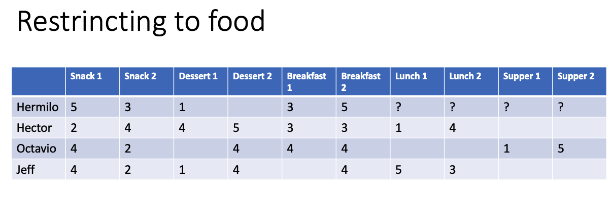
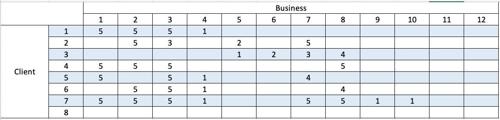
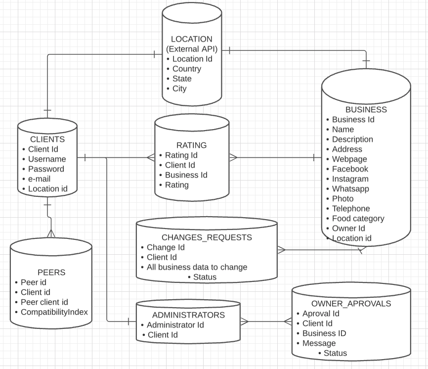
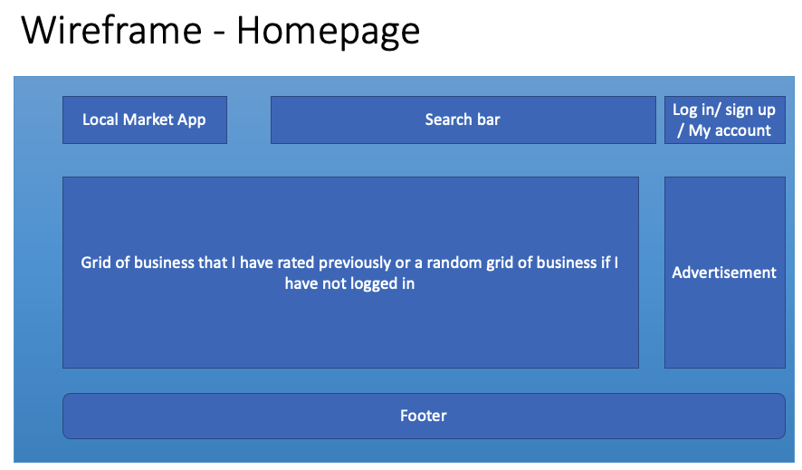
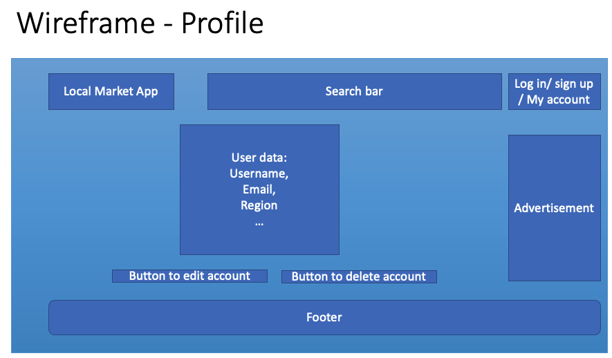

# Local market - App

## Table of Contents

- [Description](#description)
- [Project Objective](#project-objective)
- [MVP / Stretch Goals](#mvp-stretch-goals)
- [Current Features / User Stories](#current-features)
- [Wireframes](#wireframes)
- [Technologies used](#technologies-used)
- [Project takeaways](#project-takeaways)
- [Samples](#samples)
- [Links](#links)
- [References](#references)

## Description

* App to get recommendations about local bussiness based on you rating history of other business
Two user modes:
    + Advertiser (Small business): Plumber, bakery, florist
    + Costumer:  Anyone
* Location based (Restrict the search area)
* Use the database to match you with other costumers with simmilar advertiser ratings. Then make suggestion extrapolating from there

## Project objectives

## MVP / Strech goals

### Strech goals

* Manage schedules. For example you want a plumber. It gives you 3 options but you need it Monday afternoon
* Advertisement according to the search (If I seek a plumber, advertise me pipes manufacturer or homedepot, and for the pumbler advertise him suppliers) Mock an advertisement API.

## Wireframes

## Technologies used

* Redux-thunk

* Some - hooks (useSelector , useDispatch)

## Project takeaways

* Project completed ¬¬:

* Deploy early!
* Develop backend and frontend in parallel
* Planning databases is crutial but do not overcomplicate them
* Think modularity early

## Links

* [Backend](https://local-market-backend-heroku.herokuapp.com/)

* [Frontend](http://hermilo-local-market.surge.sh/)

## References

* [Redux](https://www.youtube.com/watch?v=CVpUuw9XSjY)
* [Thunk-Axios](https://x-team.com/blog/react-redux-api-introduction/) [Do not use the same API, it has some issues!]